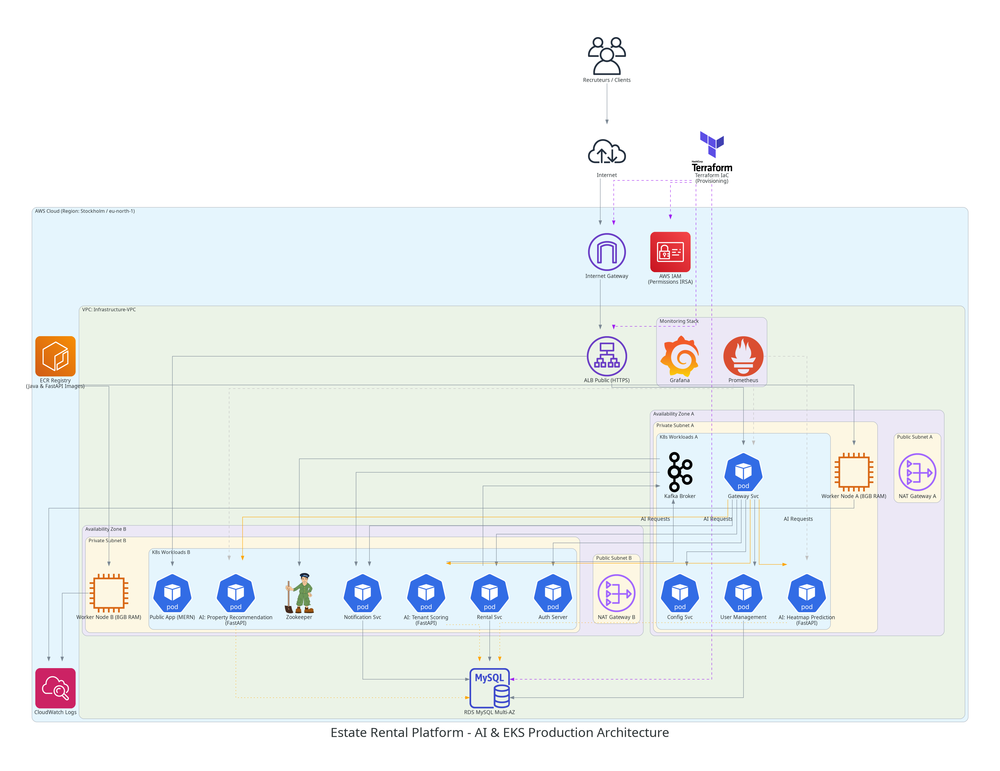

# ☁️ Estate Rental - Cloud-Native Infrastructure




## 📋 Executive Summary

This repository contains the **Infrastructure as Code (IaC)** for the **Estate Rental** platform, a modern, AI-powered real estate solution. Built on **AWS** using **Terraform**, this infrastructure is designed for **high availability**, **scalability**, and **security**. It leverages **Amazon EKS** for orchestrating microservices and AI models, ensuring a robust foundation for the application's "Cloud-Native" architecture in the **Stockholm (eu-north-1)** region.

## 🚀 Core Architecture Features

*   **High Availability**: Multi-AZ deployment across `eu-north-1a` and `eu-north-1b`.
*   **Security First**: Strict network isolation with Private Subnets for compute and data layers.
*   **Scalable Compute**: Auto-scaling EKS Node Groups using `m7i-flex.large` instances.
*   **AI Integration**: Dedicated infrastructure for hosting FastAPI-based AI models (Heatmap, Recommendation, Scoring).
*   **Automated Lifecycle**: ECR repositories with automated image scanning and lifecycle policies.
*   **Cost Optimized**: Strategic use of NAT Gateways and Spot/On-Demand instance mix capabilities.

## 🛠️ Tech Stack

| Component | Technology | Description |
| :--- | :--- | :--- |
| **Cloud Provider** | AWS | Region: eu-north-1 (Stockholm) |
| **IaC** | Terraform | Infrastructure provisioning and state management |
| **Orchestrator** | Amazon EKS | Kubernetes v1.29 |
| **Compute** | EC2 (m7i-flex) | Optimized for general purpose & memory intensive workloads |
| **Database** | Amazon RDS | MySQL 8.0 (Private Subnet) |
| **Container Registry**| Amazon ECR | Secure storage for Docker images with vulnerability scanning |
| **IAM** | AWS IAM | RBAC & IRSA (IAM Roles for Service Accounts) |

## 🏗️ Detailed Infrastructure Components

### 🌐 Network (VPC)
The network is built on a **Virtual Private Cloud (VPC)** with a CIDR of `10.0.0.0/16`, divided into:
*   **Public Subnets**: Hosted in `eu-north-1a` & `eu-north-1b` for Load Balancers and NAT Gateways.
*   **Private Subnets**: Hosted in `eu-north-1a` & `eu-north-1b` for EKS Nodes and RDS.
*   **Traffic Flow**: Outbound traffic for private resources is routed through a **NAT Gateway** in Zone A.

### 💻 Compute (EKS)
*   **Cluster**: `estate-rental-cluster` (v1.29).
*   **Node Group**: `estate-rental-nodes`.
    *   **Instance Type**: `m7i-flex.large` (2 vCPU, 8GB RAM) - chosen for optimal Java/Spring Boot performance.
    *   **Scaling Strategy**: Auto-scaling configured (Min: 2, Max: 4, Desired: 3).
    *   **Placement**: Strictly deployed in Private Subnets for security.

### 💾 Data & Messaging
*   **Database**: Amazon RDS MySQL 8.0 (`db.t3.micro`).
    *   Secured within a dedicated DB Subnet Group.
    *   Access restricted to EKS nodes via Security Groups.

### 🔒 Security
*   **IAM Roles**: Granular permissions for EKS Cluster, Worker Nodes, and Load Balancer Controller.
*   **OIDC Provider**: Integrated for secure authentication of service accounts (IRSA).
*   **ECR Security**: Automated "Scan on Push" enabled for all microservices repositories.

### 🤖 AI Microservices Integration
The infrastructure provisions specific ECR repositories and compute capacity to host the platform's three core AI models:
1.  **AI Heatmap**: Visualizes property demand and value.
2.  **AI Recommendation**: Personalized property suggestions.
3.  **AI Scoring**: Tenant scoring and risk assessment.
These services run as pods within the EKS cluster, leveraging the high-memory nodes (`m7i-flex`) for efficient inference.

## 📦 Deployment Guide

### Prerequisites
*   AWS CLI configured with appropriate permissions.
*   Terraform installed (v1.5+).

### Steps

1.  **Initialize Terraform**
    ```bash
    terraform init
    ```

2.  **Review the Plan**
    ```bash
    terraform plan
    ```

3.  **Apply Infrastructure**
    ```bash
    terraform apply -auto-approve
    ```

4.  **Configure kubectl**
    ```bash
    aws eks update-kubeconfig --region eu-north-1 --name estate-rental-cluster
    ```

## 📤 Outputs

After a successful deployment, Terraform will output the following critical information:

*   `rds_endpoint`: The connection endpoint for the MySQL database.
*   `eks_cluster_name`: Name of the created Kubernetes cluster.
*   `ecr_repository_urls`: List of URLs for pushing Docker images.

---
*Architected with ❤️ by the Estate Rental DevOps Team.*
